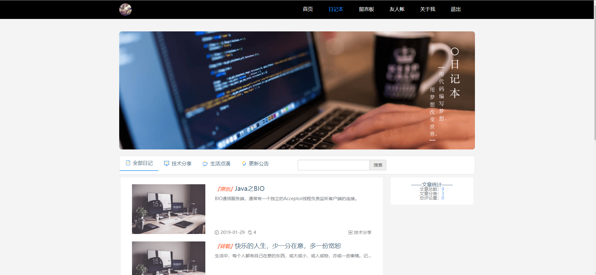
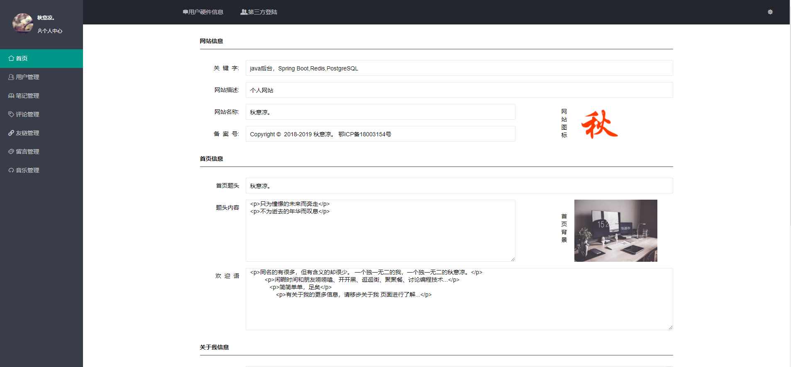
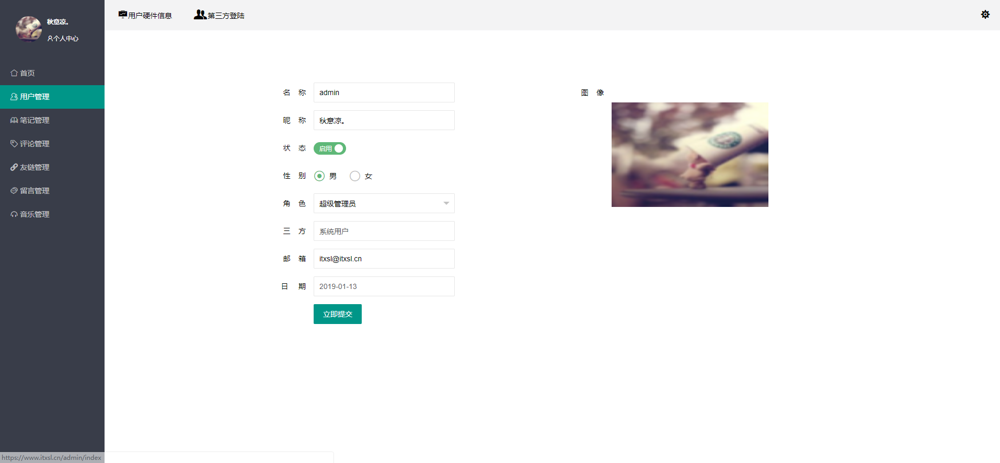
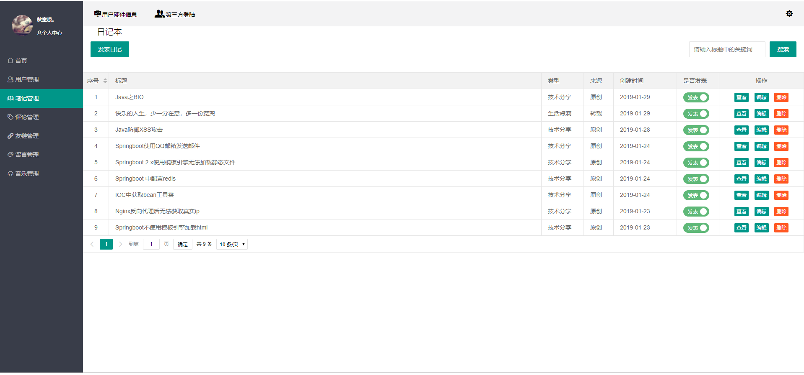
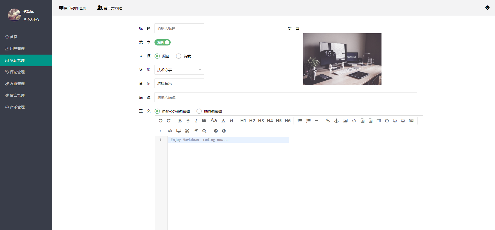

# itxsl

#### 介绍
个人网站
前台界面来自“如初。” 

后台界面自己使用layui完成

支持QQ登录，微博登录，个人账户登录

个人博客待完善中。。。。。。。

#### 软件架构
软件架构说明

SpringBoot

SpringSecurity

Nutz

#### 安装教程

1. 安装PostgreSQL
2. 安装Redis
3. 安装Jdk

#### 使用说明

application-product.yml文件配置

1. 更改spring.qq下参数
2. 更改spring.weibo下参数
3. 更改存储服务器地址spring.oss下参数配置

# 博客界面
### 网站首页

### 博客展示界面

# 后台管理界面
### 网站基本信息设置

### 用户管理

### 文章管理

### 添加文章
##### 添加文章采用WangEditor和Editor.md(Markdown)双编辑器

